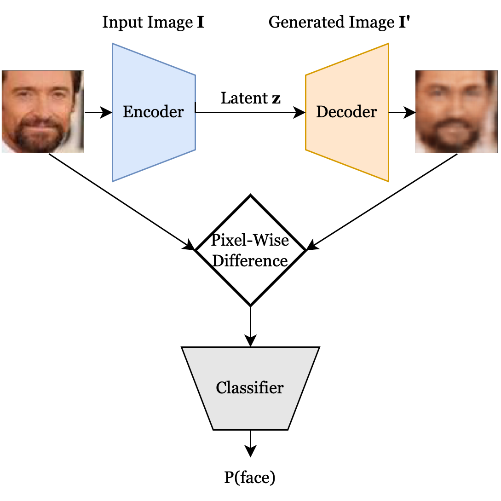

# cpsc452-project

This is our final project code repository for Yale's Deep Learning (CPSC 452) class. We train a convolutional variational autoencoder to learn a latent representation of face images. The model architecture is detailed below: 

